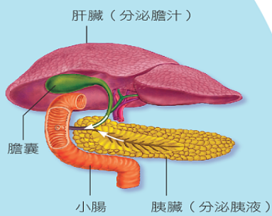

deck:: 自然一上::第二課-動物如何獲得養分

- # 攝食方式
	- 從環境中攝取大部分生存所需
	- 過程包括 #card
		- 攝食、消化和吸收
	- ## 例
		- ### 變形蟲 #card
			- 將環境中的食物直接攝取進入細胞內
		- ### 水螅 #card
			- 利用觸手捕捉水中的動物
		- ### 蝴蝶 #card
			- 利用管狀的 器吸食花蜜
		- ### 人類 #card
			- 利用口中的牙齒來撕裂與磨碎
- # 消化作用與吸收
	- 因蛋白質、澱粉和脂質需分解成較小的分子
		- 由攝食所獲得
	- ## 消化作用舉例 #card
		- 澱粉
			- 葡萄糖
		- 蛋白質
			- 胺基酸
		- 脂質
			- 脂肪酸和甘油
- # 人體的消化作用
	- 消化腺作用
		- 分泌消化液，以加速食物分解
	- 消化道作用
		- 使食物推進，促進食物與消化液混合
	- ## 如何進行消化作用
		- ### 口腔
		  collapsed:: true
			- 消化道
				- 牙齒可咬碎並咀嚼食物
				- 舌頭幫助食物和唾液混合
			- 消化線
				- 稱：唾腺
				- 分泌唾液
					- 唾液酵素可初步分解醣類
		- ### 咽及食道
		  collapsed:: true
			- 消化道
				- #### 咽
					- 控制物進入食道
				- #### 食道呈管狀
					- 能藉管壁的運動，推動食物進入胃中
		- ### 胃
		  collapsed:: true
			- 消化道
				- 位於腹腔的左上方
				- 呈囊狀
				- 可以容納較多的食物
			- 消化線
				- 稱：胃腺
				- 分泌胃液
					- 內含鹽酸，酵素
					- 鹽酸具殺菌和活化胃中酵素的作用
					- 酵素可分解蛋白質
		- ### 小腸
		  collapsed:: true
			- 消化道
				- 長管狀的器官
				- 盤繞在腹腔中
				- 分解食物以及吸收養分、水分的主要埸所
				- 小腸絨毛可以增加養分及水分吸收的表面積
			- 消化線
				- {:height 178, :width 287}
				- #### 肝臟
					- 分泌膽汁
						- 不含消化酵素
						- 但可進行乳化作用
							- 將脂質變成顆粒較小的脂肪球
						- 由導管送入小腸
				- #### 胰臟
					- 分泌胰液
						- 可分解醣類、蛋白質和脂質
				- #### 腸腺
					- 消化醣類、蛋白質
		- #### 大腸及肛門
		  collapsed:: true
			- 位於小腸的外側
			- 大腸功能
				- 吸收剩餘的水分
				- 將不能被吸收的食物殘渣，形成糞便
					- 纖維素可促進大腸蠕動
			- 肛門
				- 將糞便排出
	- ## 與養分分解有關的消化液
		- ||澱粉|蛋白質|脂質|
		  |唾液|分解|||
		  |胃液||分解||
		  |膽汁|||乳化|
		  |胰液|分解}|
		-
		-